# Kafka Partitioning and Topics: A Comprehensive Guide

> A deep dive into Kafka partitioning using the Pizza Shop demo system as a practical example.

## Table of Contents

- [Introduction](#introduction)
- [Question 1: Why Do We Need 3 Partitions?](#question-1-why-do-we-need-3-partitions)
- [Question 2: How Orders Get Delivered to Partitions](#question-2-how-orders-get-delivered-to-partitions)
- [Question 3: Can Partition Count Be Changed?](#question-3-can-partition-count-be-changed)
- [Question 4: More Consumers Than Partitions](#question-4-more-consumers-than-partitions)
- [Question 5: Kafka Topic Lifecycle](#question-5-kafka-topic-lifecycle)
- [Summary and Best Practices](#summary-and-best-practices)

---

## Introduction

This guide explores Kafka partitioning concepts using our Pizza Shop demo system. We'll examine real code from the project and visualize how Kafka distributes work across multiple consumers for parallel processing.

**System Overview:**

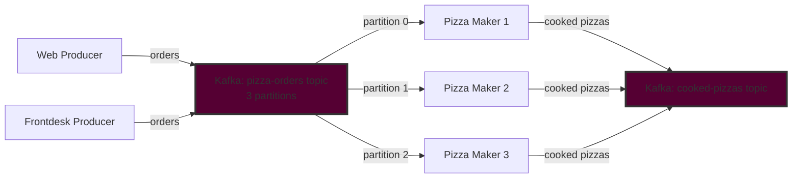

---

## Question 1: Why Do We Need 3 Partitions?

### The Purpose of Partitions

Partitions are Kafka's **fundamental unit for parallelism and scalability**. They allow multiple consumers to process messages concurrently, distributing workload across different processing units.

### Configuration in Our System

In [`scripts/init-kafka.sh:98`](../scripts/init-kafka.sh), we create the pizza-orders topic with 3 partitions:

```bash
# Create pizza-orders topic
# - 3 partitions for parallel processing by 3 pizza makers
create_topic "pizza-orders" 3 1 "delete" "604800000"
```

### Why Exactly 3 Partitions?

The design **maps directly to having 3 pizza makers** in the system:

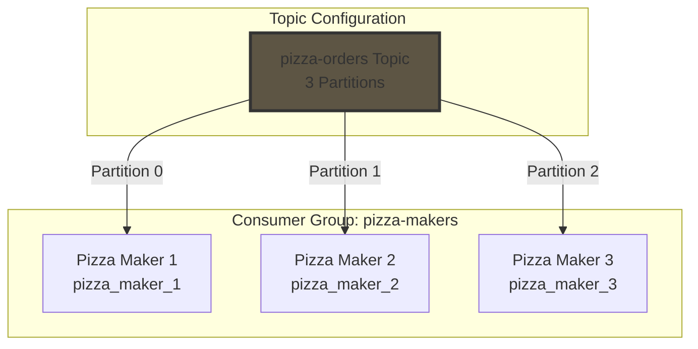

From [`src/config.py:49,70-72`](../src/config.py):

```python
CONSUMER_GROUP_PIZZA_MAKERS = "pizza-makers"

PIZZA_MAKER_1_ID = os.getenv("PIZZA_MAKER_1_ID", "pizza_maker_1")
PIZZA_MAKER_2_ID = os.getenv("PIZZA_MAKER_2_ID", "pizza_maker_2")
PIZZA_MAKER_3_ID = os.getenv("PIZZA_MAKER_3_ID", "pizza_maker_3")
```

### Benefits of Multiple Partitions

#### 1. **Parallelism** - Simultaneous Processing

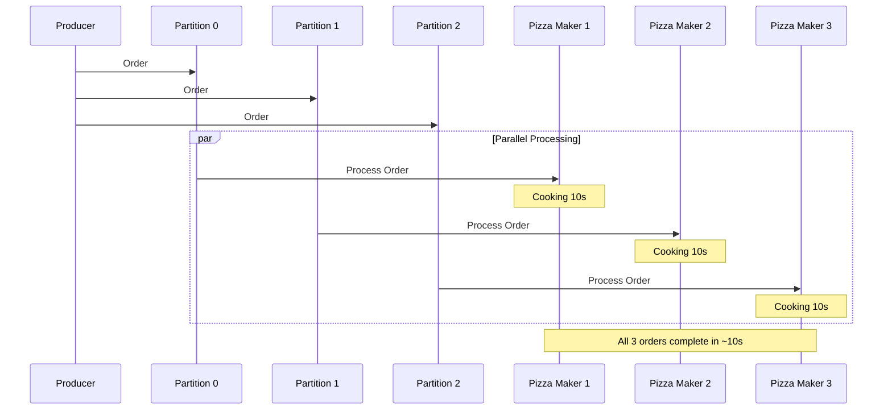

#### 2. **Scalability** - Easy to Add Consumers

- Add more pizza makers (up to 3) without code changes
- System scales horizontally by adding consumer instances
- Kafka automatically rebalances partition assignments

#### 3. **Higher Throughput** - 3x Performance

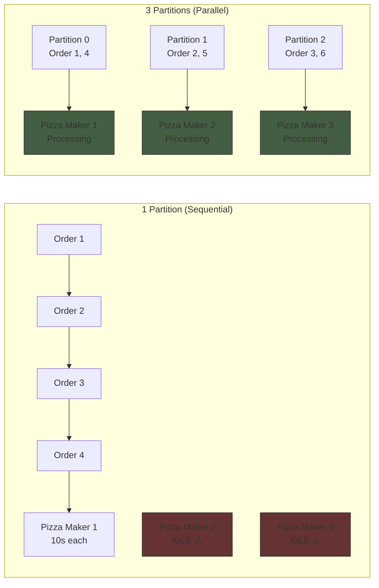

**Result:** With 3 partitions, we achieve 3x throughput compared to 1 partition!

#### 4. **Fault Tolerance** - Partition Reassignment

If Pizza Maker 2 fails, Kafka automatically reassigns Partition 1 to another healthy consumer.

### Code: Consumer Group Configuration

From [`src/consumers/pizza_maker.py:55-71`](../src/consumers/pizza_maker.py):

```python
# Create consumer for pizza-orders topic
consumer_config = get_consumer_config(
    group_id=CONSUMER_GROUP_PIZZA_MAKERS,  # All share "pizza-makers" group
    client_id=f"pizza-maker-{maker_id}"
)
self.consumer = create_kafka_consumer(consumer_config)

# Subscribe to pizza-orders topic
self.consumer.subscribe([TOPIC_PIZZA_ORDERS])
```

### Kafka's Consumer Group Partitioning

**Key principle:** Each partition is assigned to **exactly one consumer** within a consumer group.

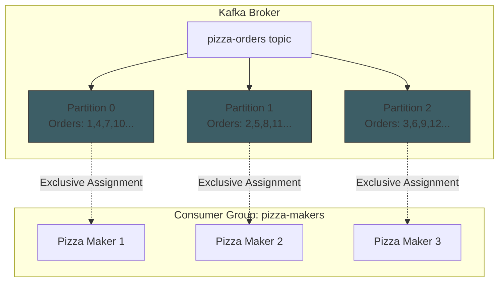

---

## Question 2: How Orders Get Delivered to Partitions

### Kafka's Partitioning Mechanism

Kafka uses a **deterministic partitioning algorithm** based on the message key to assign messages to partitions consistently.

### Our Implementation: Using order_id as Key

From [`src/producers/order_producer.py:143-147`](../src/producers/order_producer.py):

```python
# Publish order to pizza-orders topic
success = self._publish_message(
    topic=TOPIC_PIZZA_ORDERS,
    key=order["order_id"],    # ← ORDER_ID determines partition
    message=order
)
```

The actual publish operation ([`order_producer.py:92-101`](../src/producers/order_producer.py)):

```python
# Serialize message to JSON
value = json.dumps(message).encode('utf-8')
key_bytes = key.encode('utf-8')    # Convert order_id to bytes

# Publish to Kafka
self.producer.produce(
    topic=topic,
    key=key_bytes,    # ← Key determines partition assignment
    value=value,
    callback=delivery_callback
)
```

### The Partitioning Algorithm

**Formula:** `partition_number = hash(key) % number_of_partitions`

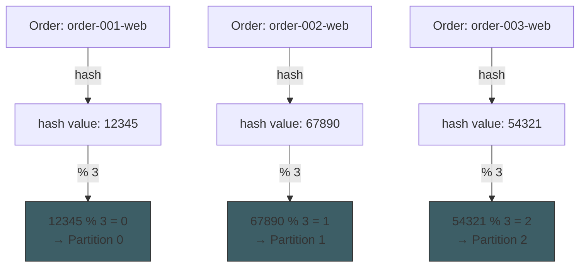

### Visual Flow: Producer to Consumer

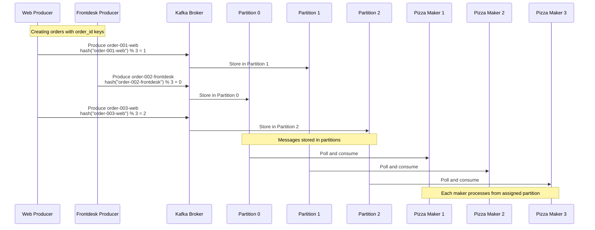

### Role of Message Keys

The message key serves **two critical purposes**:

1. **Partition Assignment:** Determines which partition receives the message
2. **Message Ordering:** All messages with the same key go to the same partition, preserving order

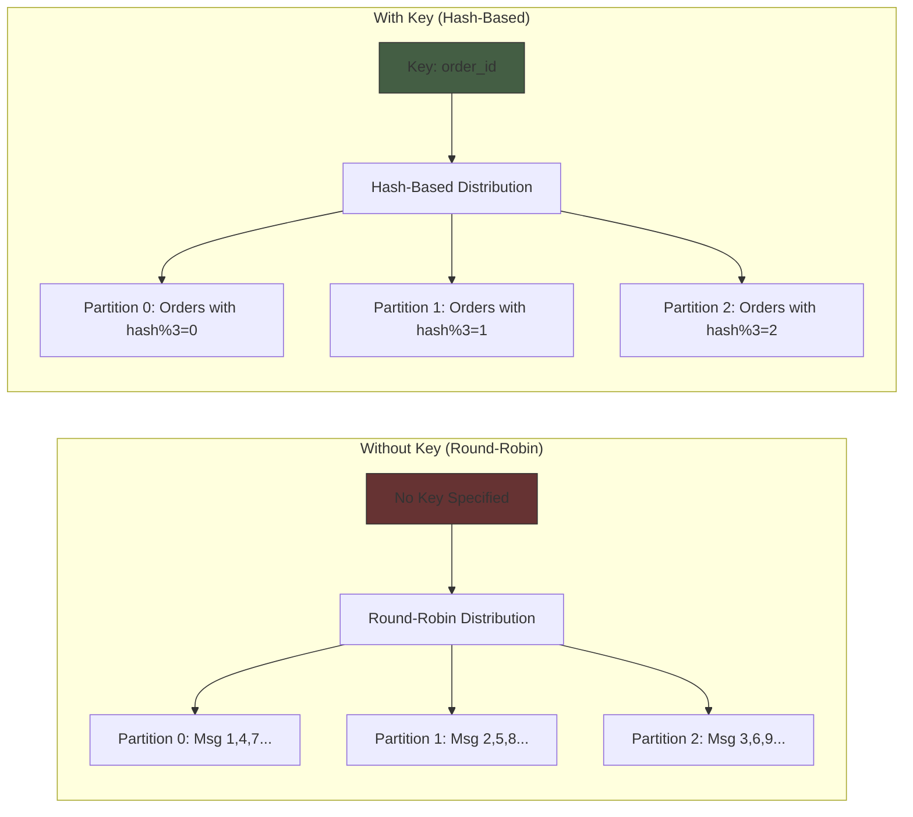

### Distribution Example from Our System

Here's how 10 orders might distribute across partitions:

| Order ID | hash(order_id) % 3 | Partition | Assigned To |
|----------|-------------------|-----------|-------------|
| order-001-web | 1 | Partition 1 | Pizza Maker 2 |
| order-002-frontdesk | 0 | Partition 0 | Pizza Maker 1 |
| order-003-web | 2 | Partition 2 | Pizza Maker 3 |
| order-004-web | 1 | Partition 1 | Pizza Maker 2 |
| order-005-frontdesk | 2 | Partition 2 | Pizza Maker 3 |
| order-006-web | 0 | Partition 0 | Pizza Maker 1 |
| order-007-web | 1 | Partition 1 | Pizza Maker 2 |
| order-008-frontdesk | 2 | Partition 2 | Pizza Maker 3 |
| order-009-web | 0 | Partition 0 | Pizza Maker 1 |
| order-010-web | 1 | Partition 1 | Pizza Maker 2 |

**Result:** Over 200 orders, each pizza maker gets approximately 67 orders - balanced workload!

### Benefits of Key-Based Partitioning

1. **Deterministic:** Same order_id always goes to the same partition
2. **Balanced:** Hash function evenly distributes load
3. **Stateless:** No coordination needed between producers
4. **Ordered:** Events for the same order_id maintain order

---

## Question 3: Can Partition Count Be Changed?

### Short Answer

**✅ YES** - Partitions can be **increased**  
**❌ NO** - Partitions **cannot be decreased**

### Initial Configuration

From [`scripts/init-kafka.sh:98`](../scripts/init-kafka.sh):

```bash
# Create pizza-orders topic with 3 partitions
create_topic "pizza-orders" 3 1 "delete" "604800000"
```

### Increasing Partitions

**Command to increase partitions:**

```bash
kafka-topics --bootstrap-server kafka:9092 \
             --alter \
             --topic pizza-orders \
             --partitions 6  # Increase from 3 to 6
```

### Impact Visualization: Before and After

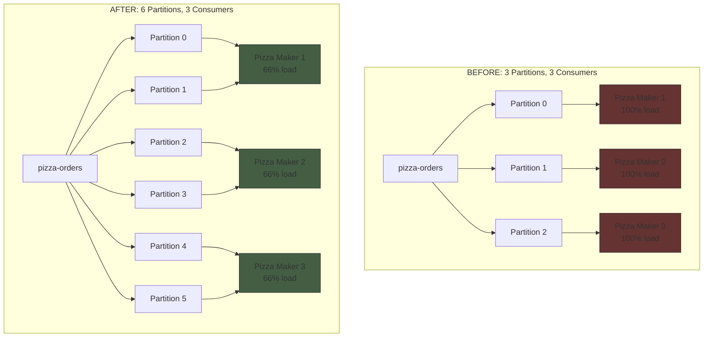

**After increasing to 6 partitions:**

- Each existing pizza maker now handles 2 partitions
- To fully utilize 6 partitions, you'd need 6 pizza makers
- Can add 3 more consumers for optimal performance

### Important Considerations

#### 1. Message Routing Changes

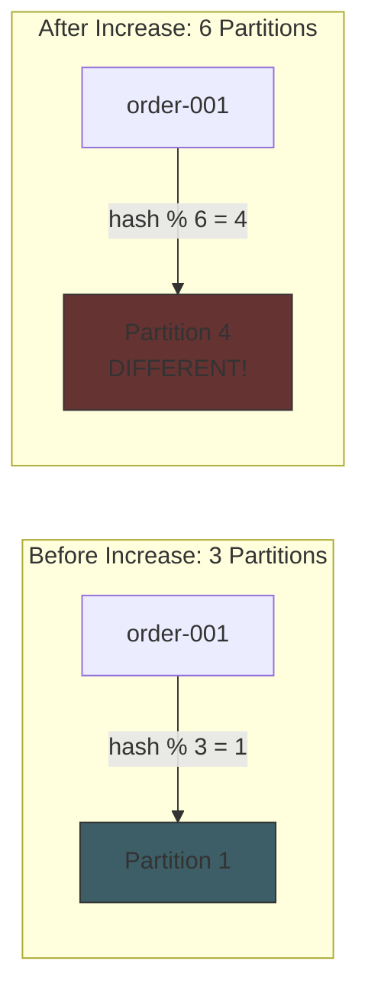

**Impact:**

- **Existing messages** stay in original partitions
- **New messages** with same key go to **different partitions**
- **Ordering guarantee** per key is **lost** across the change boundary

#### 2. Consumer Rebalancing

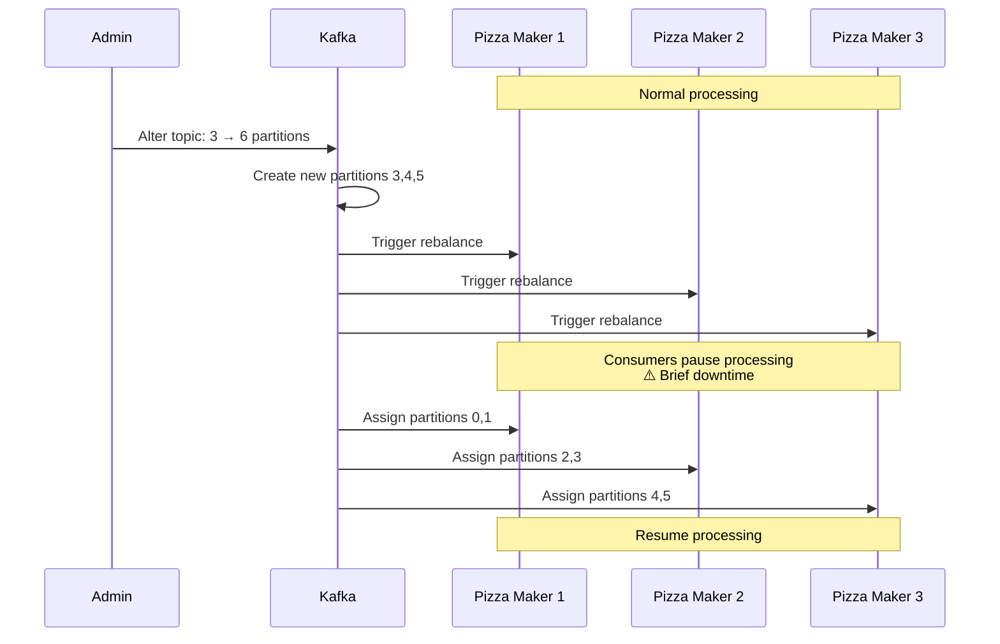

#### 3. Data Distribution Imbalance

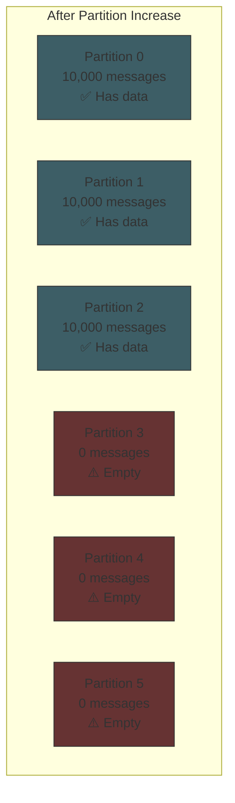

**Result:** Temporary workload imbalance until new messages fill new partitions.

### Why You Can't Decrease Partitions

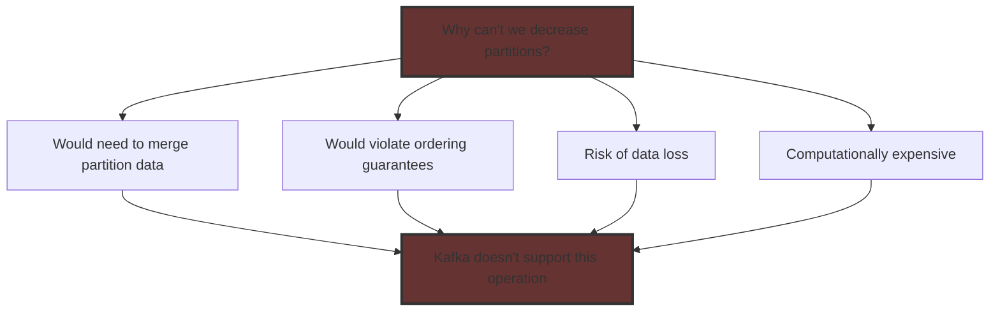

**Workaround if you need fewer partitions:**

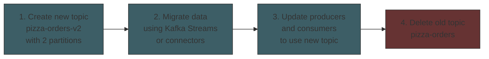

### Best Practice: Plan Ahead

**Recommendation for our pizza shop:**

```bash
# If we expect to scale to 10 pizza makers eventually:
create_topic "pizza-orders" 10 1 "delete" "604800000"

# Start with 3 pizza makers - each handles 3-4 partitions
# Scale up to 10 pizza makers without partition changes
```

**Trade-offs:**

- ✅ More partitions = more flexibility
- ❌ More partitions = higher overhead (memory, file handles)
- 📊 Kafka recommendation: < 4000 partitions per broker

---

## Question 4: More Consumers Than Partitions

### Short Answer

**YES, it's allowed** - But extra consumers will be **idle** (hot standbys).

### The Scenario

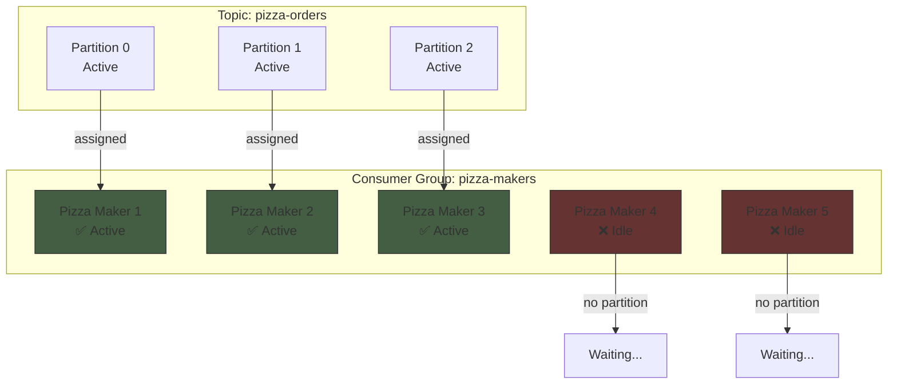

### Kafka's Partition Assignment Rule

**Key principle:** One partition can only be assigned to **one consumer** at a time within a consumer group.

**Formula:** `active_consumers = min(num_consumers, num_partitions)`

### What Idle Consumers Do

From [`src/consumers/pizza_maker.py:191-204`](../src/consumers/pizza_maker.py):

```python
while self.running:
    msg = self.consumer.poll(timeout=1.0)  # Idle consumers return None
    
    if msg is None:
        continue  # ← Idle consumers continuously loop here
    
    # Active consumers process messages here
    order_data = json.loads(msg.value().decode('utf-8'))
    self._process_order(order_data)
```

**Idle consumer behavior:**

- ✅ Connects to Kafka successfully
- ✅ Joins the consumer group
- ✅ Participates in rebalancing
- ❌ Polls but receives **no messages**
- ⚠️ Consumes system resources (memory, connections)

### Benefits: Hot Standby Pattern

#### Automatic Failover

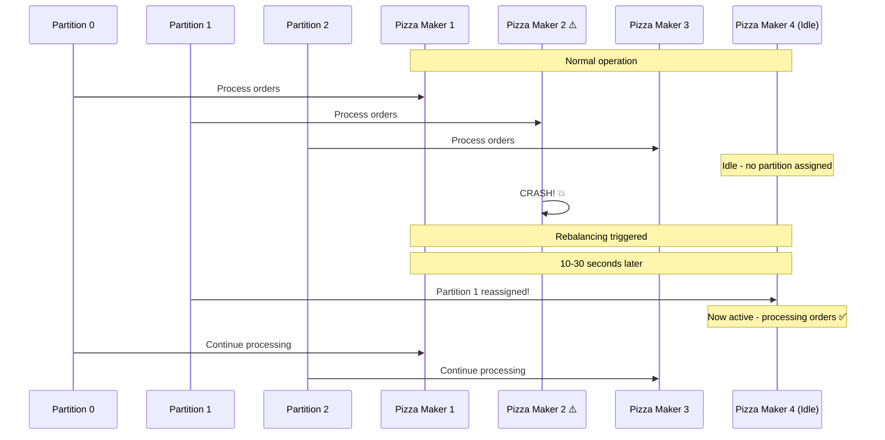

**Recovery time:** Seconds instead of minutes (no need to start new process)

### Drawbacks of Extra Consumers

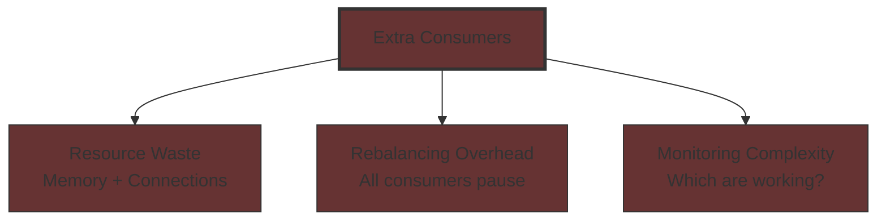

### Real-World Recommendation

**Optimal partition-to-consumer ratio:**

```
ideal_partition_count = expected_max_consumers × 2
```

**Example for our pizza shop:**

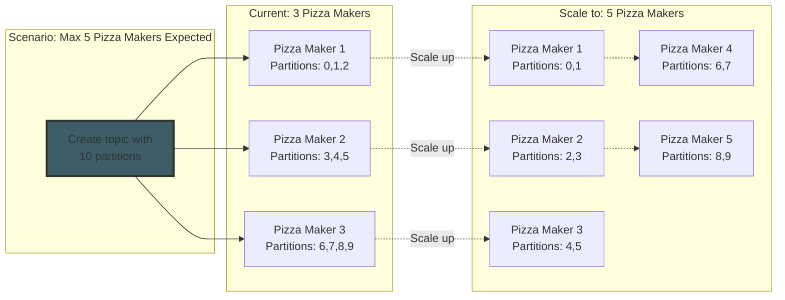

### Our Current Configuration

From [`scripts/init-kafka.sh`](../scripts/init-kafka.sh) and [`docker-compose.yml`](../docker-compose.yml):

**Optimal setup:**

- 3 partitions ✅
- 3 pizza makers ✅
- Perfect 1:1 ratio ✅

**Avoid this:**

```bash
# Don't do this with 3 partitions:
docker-compose up --scale pizza-maker=5
# Result: 2 idle consumers wasting resources ❌
```

---

## Question 5: Kafka Topic Lifecycle

### Complete Lifecycle Overview

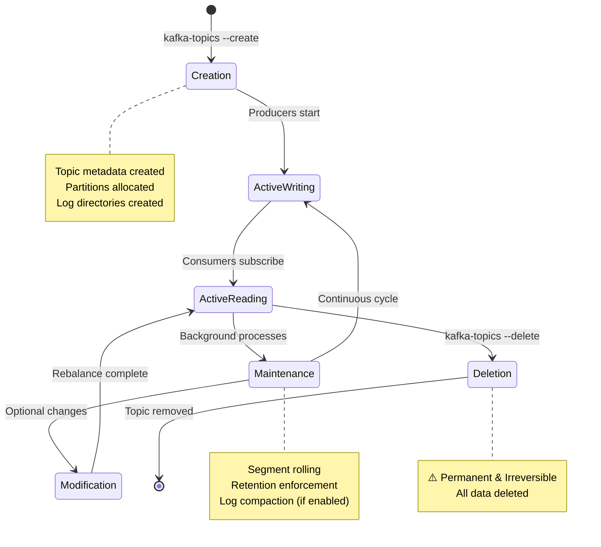

### Phase 1: Topic Creation

**Command from** [`scripts/init-kafka.sh:66-77`](../scripts/init-kafka.sh):

```bash
kafka-topics --create \
    --bootstrap-server kafka:9092 \
    --topic pizza-orders \
    --partitions 3 \
    --replication-factor 1 \
    --config cleanup.policy=delete \
    --config retention.ms=604800000  # 7 days
```

**What happens:**

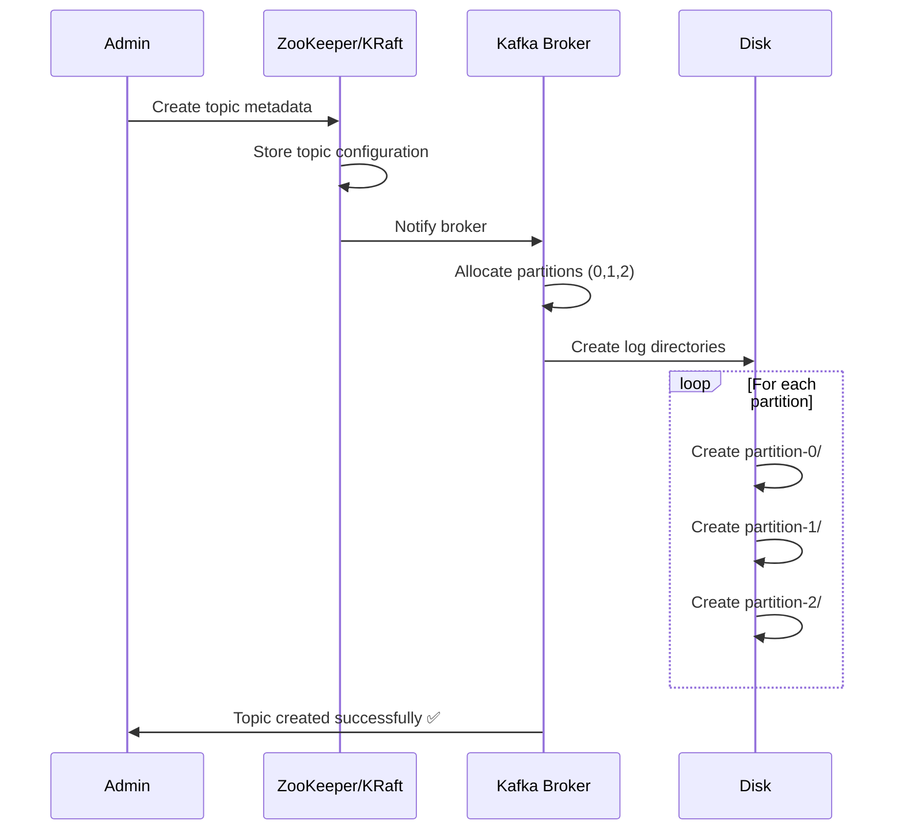

**Disk structure created:**

```
/var/lib/kafka/data/
├── pizza-orders-0/
│   ├── 00000000000000000000.log
│   ├── 00000000000000000000.index
│   └── 00000000000000000000.timeindex
├── pizza-orders-1/
│   ├── 00000000000000000000.log
│   ├── 00000000000000000000.index
│   └── 00000000000000000000.timeindex
└── pizza-orders-2/
    ├── 00000000000000000000.log
    ├── 00000000000000000000.index
    └── 00000000000000000000.timeindex
```

### Phase 2: Active Writing (Producers)

**Code from** [`src/producers/order_producer.py:96-101`](../src/producers/order_producer.py):

```python
self.producer.produce(
    topic=topic,
    key=key_bytes,
    value=value,
    callback=delivery_callback
)
```

**Message flow:**

```mermaid
sequenceDiagram
    participant P as Producer
    participant L as Leader Broker
    participant D as Disk (Log File)
    participant I as Index Files
    
    P->>L: Produce message<br/>(key, value)
    L->>L: Determine partition<br/>hash(key) % 3
    L->>D: Append to log file<br/>(append-only)
    L->>D: Flush to disk<br/>(based on config)
    L->>I: Update offset index
    L->>I: Update time index
    L->>L: Assign offset number
    L->>P: Acknowledgment<br/>offset: 12345 ✅
```

**Log file structure:**

```
Partition Log (append-only):
Offset: 0    1    2    3    4    5    6
       [M0] [M1] [M2] [M3] [M4] [M5] [M6] ← newest
        ↑                                ↑
    oldest                         high water mark
```

### Phase 3: Active Reading (Consumers)

**Code from** [`src/consumers/pizza_maker.py:193-211`](../src/consumers/pizza_maker.py):

```python
while self.running:
    msg = self.consumer.poll(timeout=1.0)
    
    if msg is None:
        continue
    
    # Process message
    order_data = json.loads(msg.value().decode('utf-8'))
    self._process_order(order_data)
```

**Consumer flow:**

```mermaid
sequenceDiagram
    participant C as Consumer
    participant B as Broker
    participant L as Partition Log
    participant O as __consumer_offsets
    
    C->>B: Poll for messages<br/>from partition 0
    B->>L: Read from log<br/>starting at offset 42
    L->>B: Return messages<br/>42-49 (batch)
    B->>C: Deliver messages
    
    C->>C: Process message 42
    C->>C: Process message 43
    C->>C: ...
    
    C->>O: Commit offset 50<br/>(auto-commit enabled)
    
    Note over C,O: Committed offset stored<br/>for consumer group
```

**Offset tracking:**

```mermaid
graph LR
    subgraph "Partition Log"
        M0[Offset 0] --> M42[Offset 42<br/>✅ Processed]
        M42 --> M43[Offset 43<br/>⏳ Processing]
        M43 --> M100[Offset 100<br/>⚪ Not read]
    end
    
    subgraph "__consumer_offsets Topic"
        CO[Consumer Group: pizza-makers<br/>Topic: pizza-orders<br/>Partition: 0<br/>Committed Offset: 42]
    end
    
    M42 -.->|Last committed| CO
    
    style M42 fill:#445e44,stroke:#333
    style M43 fill:#5d5544,stroke:#333
    style M100 fill:#4c4c4c,stroke:#333
```

### Phase 4: Message Retention and Cleanup

**Two cleanup policies in our system:**

#### Policy 1: Delete (Time-Based)

**From** [`scripts/init-kafka.sh:98`](../scripts/init-kafka.sh):

```bash
# pizza-orders topic
create_topic "pizza-orders" 3 1 "delete" "604800000"
#                           policy↑  retention↑ (7 days)
```

**Retention timeline:**

```mermaid
gantt
    title Message Retention (7 days)
    dateFormat YYYY-MM-DD
    section Messages
    Message produced           :milestone, m1, 2024-01-01, 0d
    Available for consumption  :active, 2024-01-01, 7d
    Message deleted           :milestone, m2, 2024-01-08, 0d
```

**Cleanup process:**

```mermaid
graph TD
    T[Cleanup Thread<br/>Runs every 5 min] --> C1{Check segment<br/>timestamps}
    C1 -->|Age < 7 days| K1[Keep segment]
    C1 -->|Age >= 7 days| D1[Mark for deletion]
    D1 --> D2[Delete .log file]
    D2 --> D3[Delete .index file]
    D3 --> D4[Delete .timeindex file]
    D4 --> F[Free disk space ✅]
    
    style D1 fill:#663333,stroke:#333
    style D2 fill:#663333,stroke:#333
    style D3 fill:#663333,stroke:#333
    style D4 fill:#663333,stroke:#333
```

#### Policy 2: Compact (Key-Based)

**From** [`scripts/init-kafka.sh:112`](../scripts/init-kafka.sh):

```bash
# order-events topic
create_topic "order-events" 1 1 "compact" "2592000000"
#                            policy↑  retention↑ (30 days)
```

**Compaction keeps latest message per key:**

```mermaid
graph TD
    subgraph "Before Compaction"
        B1[Key: order-001<br/>Value: ORDER_CREATED<br/>Offset: 0]
        B2[Key: order-002<br/>Value: ORDER_CREATED<br/>Offset: 1]
        B3[Key: order-001<br/>Value: COOKING_STARTED<br/>Offset: 2]
        B4[Key: order-001<br/>Value: COOKING_COMPLETED<br/>Offset: 3]
        B5[Key: order-002<br/>Value: COOKING_STARTED<br/>Offset: 4]
    end
    
    subgraph "After Compaction"
        A1[Key: order-001<br/>Value: COOKING_COMPLETED<br/>Offset: 3<br/>✅ Latest kept]
        A2[Key: order-002<br/>Value: COOKING_STARTED<br/>Offset: 4<br/>✅ Latest kept]
    end
    
    B1 -.->|Deleted| X1[❌]
    B2 -.->|Deleted| X2[❌]
    B3 -.->|Deleted| X3[❌]
    B4 --> A1
    B5 --> A2
    
    style B1 fill:#663333,stroke:#333
    style B2 fill:#663333,stroke:#333
    style B3 fill:#663333,stroke:#333
    style A1 fill:#445e44,stroke:#333
    style A2 fill:#445e44,stroke:#333
```

**Why compaction for order-events:**

- ✅ Maintains latest state for each order_id
- ✅ Historical events compacted to save space
- ✅ Can reconstruct final order state
- ✅ Audit trail preserved (30 days)

### Phase 5: Topic Modification

**Increasing partitions:**

```bash
kafka-topics --alter \
    --bootstrap-server kafka:9092 \
    --topic pizza-orders \
    --partitions 6  # Increase from 3 to 6
```

**Changing configuration:**

```bash
kafka-configs --alter \
    --bootstrap-server kafka:9092 \
    --entity-type topics \
    --entity-name pizza-orders \
    --add-config retention.ms=1209600000  # Change to 14 days
```

### Phase 6: Topic Deletion

**Deletion command:**

```bash
kafka-topics --delete \
    --bootstrap-server kafka:9092 \
    --topic pizza-orders
```

**Deletion process:**

```mermaid
sequenceDiagram
    participant A as Admin
    participant Z as ZooKeeper/KRaft
    participant B as Broker
    participant P as Producers/Consumers
    participant D as Disk
    
    A->>Z: Delete topic request
    Z->>Z: Mark topic for deletion
    Z->>P: Topic marked deleted
    P->>P: Return errors on access ⚠️
    Z->>B: Initiate deletion
    B->>B: Close partitions
    B->>D: Delete all log files
    B->>D: Delete all index files
    B->>D: Delete directories
    D->>B: Files removed ✅
    B->>Z: Deletion complete
    Z->>Z: Remove metadata
    Z->>A: Topic deleted ✅
    
    Note over A,D: ⚠️ Deletion is PERMANENT and IRREVERSIBLE!
```

### Complete Lifecycle Diagram

```mermaid
graph TD
    Start([Admin: Create Topic]) --> Create[Topic Created<br/>Metadata + Partitions + Logs]
    Create --> Produce[Producers Write Messages<br/>Append to partition logs]
    Produce --> Consume[Consumers Read Messages<br/>From assigned partitions]
    Consume --> Retain[Retention/Compaction<br/>Background cleanup]
    Retain --> Produce
    
    Produce --> Modify[Optional: Modify Topic<br/>Partitions or config]
    Modify --> Rebalance[Consumer Rebalancing]
    Rebalance --> Consume
    
    Consume --> Delete[Admin: Delete Topic]
    Delete --> End([Topic Removed<br/>All data deleted])
    
    style Create fill:#3d5e66,stroke:#333,stroke-width:2px
    style Produce fill:#445e44,stroke:#333,stroke-width:2px
    style Consume fill:#445e44,stroke:#333,stroke-width:2px
    style Retain fill:#5d5544,stroke:#333,stroke-width:2px
    style Delete fill:#663333,stroke:#333,stroke-width:2px
    style End fill:#663333,stroke:#333,stroke-width:2px
```

### Monitoring Topic Health

**Check topic status:**

```bash
# List all topics
kafka-topics --list --bootstrap-server kafka:9092

# Describe topic details
kafka-topics --describe \
    --bootstrap-server kafka:9092 \
    --topic pizza-orders
```

**Output:**

```
Topic: pizza-orders    PartitionCount: 3    ReplicationFactor: 1
    Partition: 0    Leader: 1    Replicas: 1    Isr: 1
    Partition: 1    Leader: 1    Replicas: 1    Isr: 1
    Partition: 2    Leader: 1    Replicas: 1    Isr: 1
```

**Check consumer lag:**

```bash
kafka-consumer-groups --describe \
    --bootstrap-server kafka:9092 \
    --group pizza-makers
```

**Output:**

```
GROUP           TOPIC           PARTITION  CURRENT-OFFSET  LOG-END-OFFSET  LAG
pizza-makers    pizza-orders    0          42              42              0
pizza-makers    pizza-orders    1          38              45              7
pizza-makers    pizza-orders    2          51              51              0
```

**Lag interpretation:**

```mermaid
graph LR
    L0[Partition 1<br/>LAG = 7] --> W[⚠️ Pizza Maker 2<br/>falling behind]
    L1[Partition 0<br/>LAG = 0] --> G[✅ Pizza Maker 1<br/>keeping up]
    L2[Partition 2<br/>LAG = 0] --> G2[✅ Pizza Maker 3<br/>keeping up]
    
    style L0 fill:#663333,stroke:#333
    style L1 fill:#445e44,stroke:#333
    style L2 fill:#445e44,stroke:#333
```

---

## Summary and Best Practices

### Key Takeaways

```mermaid
mindmap
  root((Kafka<br/>Partitioning))
    Purpose
      Parallelism
      Scalability
      Throughput
      Fault Tolerance
    Partitioning
      Hash based on key
      Deterministic routing
      Even distribution
      Ordering per key
    Consumer Groups
      One partition per consumer
      Automatic rebalancing
      Hot standby support
      Coordinated assignment
    Lifecycle
      Creation with config
      Active read write
      Retention cleanup
      Optional modification
      Permanent deletion
```

### Best Practices from Pizza Shop System

#### 1. **Match Partitions to Expected Consumers**

```python
# Good: 3 partitions for 3 pizza makers
partitions = 3
consumers = 3
# Result: Perfect 1:1 ratio ✅
```

#### 2. **Plan for Growth**

```python
# Better: Allow for future scaling
partitions = expected_max_consumers * 2
# Start with 3, scale to 10 without partition changes
```

#### 3. **Use Keys for Ordering**

```python
# Good: Use order_id as key
producer.produce(
    topic="pizza-orders",
    key=order["order_id"],  # ✅ Ensures ordering per order
    value=order
)
```

#### 4. **Set Appropriate Retention**

```bash
# Transactional data: Short retention
create_topic "pizza-orders" 3 1 "delete" "604800000"  # 7 days

# Audit logs: Long retention + compaction
create_topic "order-events" 1 1 "compact" "2592000000"  # 30 days
```

#### 5. **Monitor Consumer Lag**

```bash
# Regular monitoring prevents processing delays
kafka-consumer-groups --describe --group pizza-makers
```

### Architecture Recommendations

**For production systems:**

```mermaid
graph TD
    A[Define Requirements] --> B{Expected Throughput?}
    B -->|High| C[More partitions<br/>10-20+]
    B -->|Medium| D[Moderate partitions<br/>3-10]
    B -->|Low| E[Few partitions<br/>1-3]
    
    C --> F{Scaling Plans?}
    D --> F
    E --> F
    
    F -->|Known max| G[Partitions = max_consumers]
    F -->|Uncertain| H[Partitions = max_consumers × 2]
    
    G --> I[Set Retention Policy]
    H --> I
    
    I --> J{Data Type?}
    J -->|Transactional| K[cleanup.policy=delete<br/>Short retention]
    J -->|State/Events| L[cleanup.policy=compact<br/>Long retention]
    
    K --> M[Monitor & Adjust]
    L --> M
    
    style A fill:#3d5e66,stroke:#333,stroke-width:2px
    style M fill:#445e44,stroke:#333,stroke-width:2px
```

### Quick Reference Table

| Scenario | Partitions | Consumers | Result |
|----------|-----------|-----------|--------|
| Optimal | 3 | 3 | ✅ Perfect balance, max throughput |
| Under-partitioned | 1 | 3 | ⚠️ 2 consumers idle, wasted resources |
| Over-partitioned | 10 | 3 | ⚠️ Each consumer handles 3-4 partitions |
| Hot standby | 3 | 5 | ⚠️ 2 idle consumers for failover |
| Scalable | 10 | 3-10 | ✅ Can scale without partition changes |

### Common Anti-Patterns to Avoid

```mermaid
graph LR
    A[❌ Too few partitions] --> A1[Sequential processing<br/>Low throughput]
    B[❌ Too many idle consumers] --> B1[Wasted resources<br/>Higher costs]
    C[❌ No message keys] --> C1[Lost ordering<br/>Unpredictable routing]
    D[❌ Decreasing partitions] --> D1[Not supported<br/>Must recreate topic]
    E[❌ Ignoring consumer lag] --> E1[Processing delays<br/>System degradation]
    
    style A fill:#663333,stroke:#333
    style B fill:#663333,stroke:#333
    style C fill:#663333,stroke:#333
    style D fill:#663333,stroke:#333
    style E fill:#663333,stroke:#333
```

### Conclusion

The Kafka Pizza Shop demo demonstrates production-ready partitioning patterns:

✅ **3 partitions** enable parallel processing by 3 pizza makers  
✅ **Key-based routing** ensures consistent partition assignment  
✅ **Consumer groups** provide automatic load balancing  
✅ **Retention policies** manage disk space efficiently  
✅ **Monitoring** ensures system health and performance

By understanding these concepts, you can design scalable, high-throughput Kafka applications that efficiently process millions of messages while maintaining ordering guarantees and fault tolerance.

---

## Additional Resources

- [Kafka Official Documentation](https://kafka.apache.org/documentation/)
- [Pizza Shop Demo Repository](https://github.com/mxcoppell/kafka-pizza-shop)
- [`scripts/init-kafka.sh`](../scripts/init-kafka.sh) - Topic creation scripts
- [`src/producers/order_producer.py`](../src/producers/order_producer.py) - Producer implementation
- [`src/consumers/pizza_maker.py`](../src/consumers/pizza_maker.py) - Consumer implementation
- [`src/config.py`](../src/config.py) - System configuration

---

**Generated for:** Kafka Pizza Shop Learning System  
**Last Updated:** 2026-01-11  
**Author:** System Documentation
